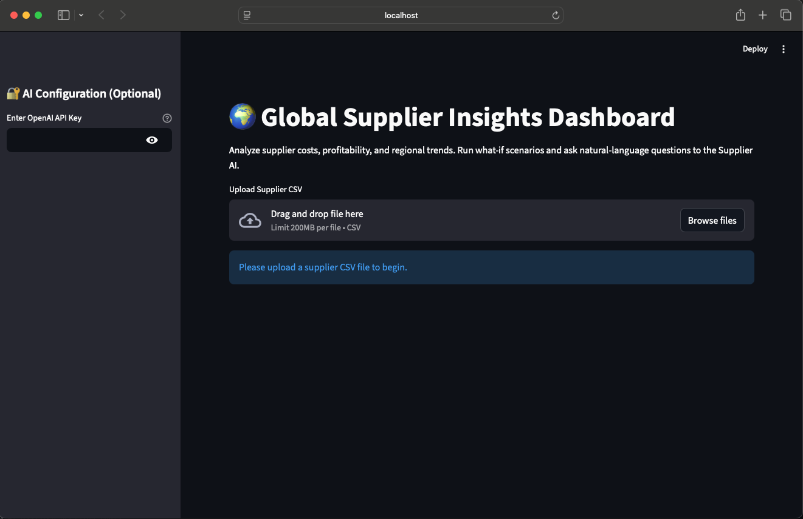
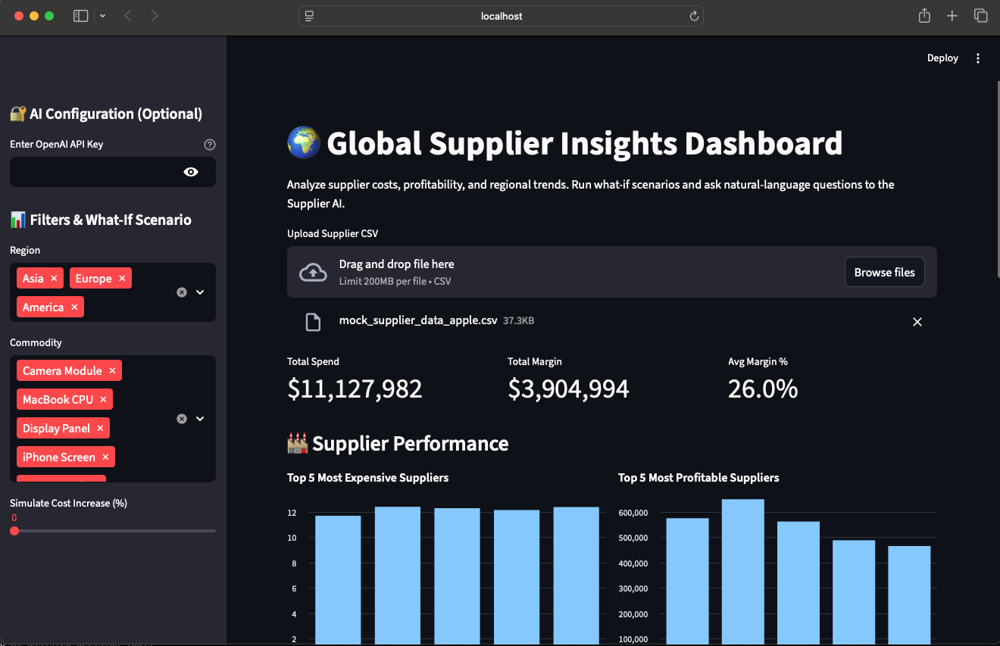
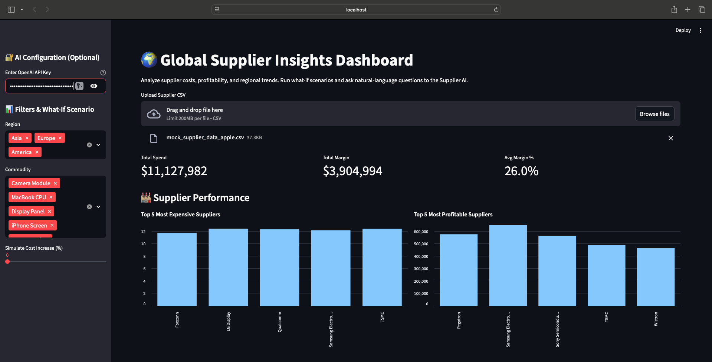
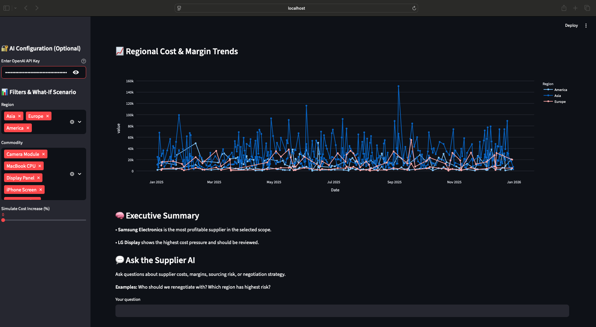
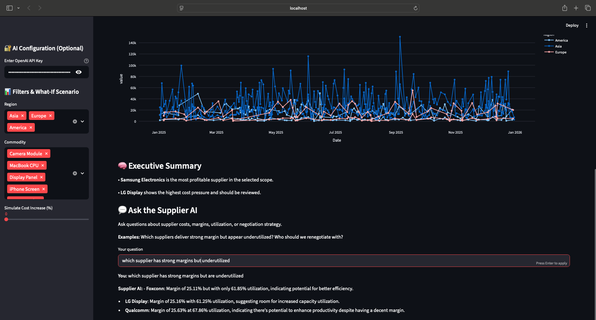

🌍 Supplier Insights AI Dashboard

Interactive prototype showcasing AI-powered supplier analytics and executive insights.
Analyze supplier costs, profitability, and regional trends. Run “what-if” scenarios and ask questions in natural language to get concise, actionable advice for strategic sourcing decisions.

🚀 Features

1. Supplier Performance Insights
    Top 5 most expensive suppliers
    Top 5 most profitable suppliers

2. Regional Trends & What-If Modeling
    Simulate cost increases (0–50%)
    Monitor margins by region or commodity
    Identify suppliers at risk of margin erosion

3. Executive AI Chatbot
    Ask questions like:
    Who should we renegotiate with?
    Which region has the highest sourcing risk?
    Which high-margin suppliers are underutilized?
  AI provides concise, 3-bullet actionable insights

4. Interactive Dashboard
    Built with Streamlit
    Data visualizations via Plotly
    CSV upload for your own supplier data

📊 Screenshots

| Dashboard Overview                | Supplier Rankings                 |
| --------------------------------- | --------------------------------- |
|  |  |
| Regional Trends                   | AI Chatbot                        |
|  |  |
| What-If Scenario                  | Export / Insights                 |
|  |  |

🛠️ How to Run Locally
1. Clone the repository
   git clone https://github.com/JaishreeViswanathan/supplier-insights-ai-demo.git
   cd supplier-insightsdemo-ai-app

2. Install dependencies
   pip install streamlit pandas plotly openai

3. Run the dashboard
   streamlit run supplier_dashboard.py

4. Optional – Enter your OpenAI API key in the sidebar to enable live AI insights. Otherwise, mock AI advice will be shown.

💡 How this prototype helps
Demonstrates AI product thinking for managers and executives
Provides actionable supplier insights from complex data
Showcases interactive dashboards + conversational AI
Highlights ability to turn enterprise data into decisions
